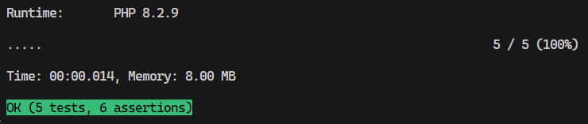

# Rectangle Collision Detection

This project demonstrates a PHP-based collision detection solution for 2D rectangles. It follows SOLID principles by separating concerns into multiple classes and files. Users can provide rectangle definitions via an HTML form, and the application will detect and output any collisions between the rectangles.

## Features

- **2D Collision Detection:** Uses Axis-Aligned Bounding Box (AABB) algorithm to determine if rectangles collide.
- **SOLID Design:** Implements separation of concerns by splitting the application into distinct components (shapes, collision detection, and output).
- **User Input:** Provides an HTML form (`index.php`) for users to enter rectangle data.
- **Separation of Logic:** Collision detection logic is implemented in `collisions.php`, keeping UI separate from business logic.
- **PHPUnit Tests:** Includes tests for both collision detection logic and HTML output formatting.

## Requirements

- PHP 7.4 or higher
- A web server (e.g., Apache, Nginx) or PHP’s built-in server
- [PHPUnit](https://phpunit.de/) for running tests

## Installation

1. **Clone the Repository:**

   ```bash
   git clone https://github.com/adryyy10/collision-detection
   cd collision-detector
   ```

2. **Install dependencies:**

   ```bash
   composer install
   ```

## Usage

1. **Run this command**
   ```bash
   php -S localhost:8000
   ```

2. **Access this URL**
   ```bash
   http://localhost:8000/index.php
   ```

3. Enter one rectangle per line in the format:
   ```bash
   x,y,width,height
   ```

   **Example**
   ```bash
    0,0,10,10
    5,5,10,10
    20,20,5,5
    8,8,3,3
    ```

## Run tests

```bash
./vendor/bin/phpunit ./tests
```

